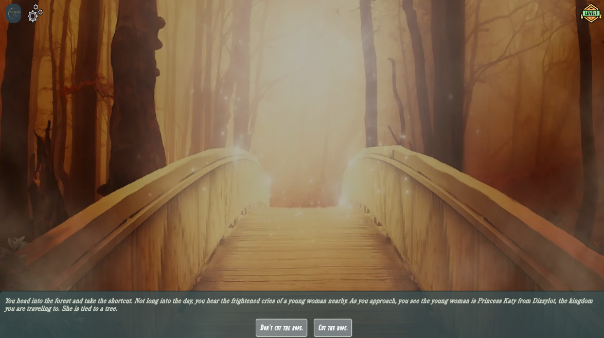

# The Queen and Her Guard

## Table of Contents
1. [Description](#description)
2. [Visuals](#visuals)
3. [Installation](#installation)
4. [Tech Stack](#tech-stack)
5. [Links](#links)
6. [Usage](#usage)
7. [Group Collaboration](#group-collaboration)
8. [Team Wins](#team-wins)
9. [Project Requirements](#project-requirements)
10. [Acknowledgments](#acknowledgments)
11. [Authors and Collaborators](#authors-and-collaborators)
12. [Support](#support)

## Description
The Queen and Her Guard is a narrative game where the player takes on the role of a new guard joining the Queen's royal forces. The player will make choices that determine their progression through the story and relationship with other characters.

## Visuals
* Home Page

* Profile Page

* Login Page

* Game Page

## Installation
* When you copy the repo down, run <code>npm i</code> in the root of the directory 
* Copy the <code>.env.EXAMPLE</code> and paste a new <code>.env</code> in the root of the directory 
* Enter the information for your postgres login in the <code>.env</code>
* Go into the <code>db directory</code> and login to postgres
* Then run <code>\i schema.sql</code>
* Exit postgres with <code>\q</code>
* Go back to the root of the directory and open a new terminal and run <code>node server.js</code>
* Open <code>http://localhost:3001</code> in the browser or click in the terminal on <code>Now listening @ http://localhost:3001</code>

## Tech Stack:
- Node.js
- Express.js
- Sequelize ORM
- Bcrypt for password hashing
- Express
- Handlebars
- JavaScript
- CSS
- jQuery
- TypeItJS for text-animation
- Home-made API

## Links:
- Link to deployed version on Render: [Click me](https://choose-your-adventure-qxmy.onrender.com)
- Repo: [Click me](https://github.com/TyWalter/choose-your-adventure)
- Presentation Slides:
- Google Docs Working Dcoument:

## Usage
- This is a made from scratch choose your adventure story-based game that is meant to be played and enjoyed. It keeps track of your overrall stats and can be replayed several different times and there are several different outcomes. Can you save the princess?
- This is meant to be played on a computer screen, however, it's also setup with responsiveness for an iphone 14 Pro Max as well. We're sorry about other screen sizes not being queried!

## Group Collaboration:
Challenges:
- Merging storylines with different branches
- Creating character profiles using Handlebars templates with data from a Sequelize Character model
- Developing branching storylines using Handlebars conditionals and partials with data from a Sequelize Story model
 
## Team Wins:
- Successfully implemented Handlebars templates to dynamically render character profiles
- Built out branching storylines using Handlebars conditionals and partials
- Rendered character profiles and story pages dynamically using Handlebars templates with data from Sequelize Character and Story models
- Implemented user authentication with Bcrypt for additional user features
- Added login/signup pages with form validation using express-validator
- Integrated user model association with character and story models to allow logged in users to view their profiles and stories
- Added user authentication middleware to story and character routes to restrict access to logged in users only
- Implemented login/logout routes with POST requests
- Added login and signup form validation using express-validator middleware
- Implemented POST /login and POST /signup routes to handle form submissions and authentication
- Added GET /logout route to handle logout requests
- Implemented logout functionality by clearing req.session

## Project Requirements:
- [Project 2 Requirements and Notes](https://docs.google.com/document/d/1fJ2dYtbmMBDxmZlDZ3rP0PYQKk4UAzI7jzBZD0HVC4w/edit)

## Acknowledgments
* Thank you to [Bcrypt](https://www.npmjs.com/package/bcrypt)
* Thank you to [Connect-Session-Sequelize](https://www.npmjs.com/package/connect-session-sequelize)
* Thank you to [Dotenv](https://www.npmjs.com/package/dotenv)
* Thank you to [Express](https://www.npmjs.com/package/express)
* Thank you to [Express-Handlebars](https://www.npmjs.com/package/express-handlebars)
* Thank you to [Express-Session](https://www.npmjs.com/package/express-session)
* Thank you to [FlatIcon](https://www.flaticon.com/)
* Thank you to [Font Awesome](https://fontawesome.com/)
* Thank you to [Google Fonts](https://fonts.google.com/)
* Thank you to [Handlebars](https://handlebarsjs.com/)
* Thank you to [Path](https://www.npmjs.com/package/path)
* Thank you to [Pg](https://www.npmjs.com/package/pg)
* Thank you to [Sequelize](https://www.npmjs.com/package/sequelize)
* Thank you to [TypeItJS](https://www.typeitjs.com/)

## Authors and Collaborators
* [Adam Shew](https://github.com/Adam-Shew)
* [Anna Manrodt](https://github.com/AnnaManrodt)
* [Jackie Funk](https://github.com/JKrech01)
* [Tyler Walter](https://github.com/TyWalter)

## Support
* [Gary Almes](https://github.com/garytalmes)
* [Katy Vincent](https://github.com/KatyKedi)
* [Vanessa Bou](https://github.com/rvbouu)
* [You.com](https://you.com)